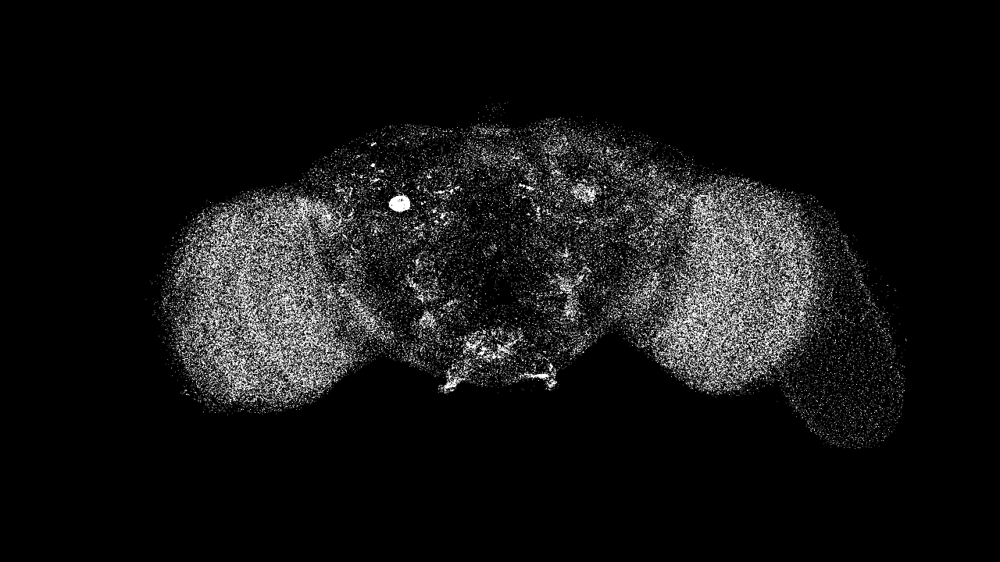

# FlyBrain



A TouchDesigner tool that loads the FlyWire fruit-fly connectome ([codex.flywire.ai](https://codex.flywire.ai)) and runs it as a POP network.

Watch the point cloud or use it as a "black box": feed a signal in through one group of neurons and read a different signal back out of another.

## The **FAFB** Dataset

The **FAFB** dataset (Feamle Adult Fly Brain) is a full reconstruction of one fly's brain, with ~139,000 neurons and about 3.7 million synpatic connections.

Every neuron has a `super_class` label, describing it's general function:

| `super_class` | What it means | Good for |
| --- | --- | --- |
| `sensory` | Receives input from the eyes, antennae, etc. | Feeding a signal **into** the network |
| `central` | The "in-between" neurons doing most of the processing | This is where the recurrent behavior happens |
| `descending` | The brain's output channel to the rest of the body | Reading a signal **out** of the network |
| `motor`, `ascending`, `endocrine`, `optic`, `visual_projection`, `visual_centrifugal` | More specific roles (movement, body-to-brain signals, hormones, vision) | Fine-tuning which parts of the brain you include |

## Building the graph

The data pipeline (`Code/pipeline/`) turns Codex's public data into one CSV that TouchDesigner loads directly.

1. Get a free Codex API token: sign in at
   [codex.flywire.ai](https://codex.flywire.ai), open your account page, and copy the **"Codex API token"** field.

2. Set it as an environment variable:

   ```cmd
   set CODEX_API_TOKEN=...          
   ```

   ```PowerShell
   $env:CODEX_API_TOKEN=...
   ```

3. From `Code/pipeline/`:

   ```cmd
   pip install -r requirements.txt
   python download_codex.py
   python build_graph.py
   ```

`download_codex.py` fetches the raw data into `Data/raw/`.
`build_graph.py` filters it, computes neuron positions and connection strengths, and writes the finished graph to `Data/k_<N>/neurons.csv` (`<N>` is the gather width,see below).

### Configuring the graph

What gets built is controlled by `Code/pipeline/config.yaml`:

- **`subset`**: which neurons to include (by `super_class`, by brain region, or a hard count cap).
- **`gather.max_in_degree`**: how many incoming connections each neuron remembers (the strongest ones win if it has more). This also names the output folder (`max_in_degree: 64` writes to `Data/k_64/`).
- **`neurotransmitter_sign`** / **`weight`**: how a connection's  predicted chemistry becomes a signed, scaled strength.

## Using it in TouchDesigner

The actual network (points, GPU compute shader, feedback loop,rendering) is already built for you as a component in **`FlyBrain.tox`**.
Drag it into your own project and point it at a `Data/k_<N>/neurons.csv` you've built.

> Warning: The full dataset can be quite heavy without a modern GPU and enough RAM, adjust the settings for performance in `Code/pipeline/config.yaml`
